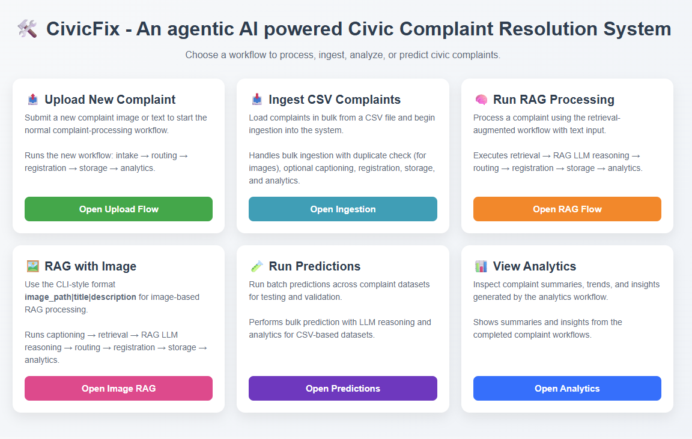

# Civil Complaint Resolver

An AI-powered civil complaint resolution system that automatically analyzes, categorizes, and routes civil complaints to appropriate authorities. Supports both image-based and text-based complaints with intelligent duplicate detection and comprehensive analytics.

## Features

- **Multi-modal Input**: Accept complaints via images, URLs, or text descriptions
- **AI-Powered Analysis**: Uses advanced language models to categorize complaints by type, severity, and authority
- **Intelligent Routing**: Automatically routes complaints to the appropriate government authority (MoRTH, Municipal Corporation, BESCOM, etc.)
- **Duplicate Detection**: Perceptual hashing prevents duplicate complaint submissions
- **Vector Database**: Chroma-based vector storage for efficient complaint search and retrieval
- **Web Interface**: Modern Flask-based web application with tabbed input interface
- **CLI Interface**: Command-line interface with multiline input support
- **Analytics Dashboard**: Comprehensive analytics showing complaint trends and authority breakdowns
- **RESTful API**: Programmatic access for integration with other systems

## Web UI Overview

The web interface presents the main workflows as a clean dashboard with six tiles:

- **Upload New Complaint**: Start the standard intake workflow using image or text input
- **Ingest CSV Complaints**: Load bulk complaints from a CSV file
- **Run RAG Processing**: Process text complaints with retrieval-augmented reasoning
- **RAG with Image**: Process image-based complaints with captioning + RAG
- **Run Predictions**: Execute batch predictions on CSV datasets
- **View Analytics**: Explore complaint trends, categories, and routing insights



> Note: Image inputs can be a remote URL or a local image saved under `data/images/`.

## Prerequisites

### System Requirements
- **Python**: 3.10 or higher
- **Operating System**: Windows, macOS, or Linux
- **RAM**: Minimum 8GB (16GB recommended for better performance)
- **Storage**: 12GB free space for models and vector database

### Required Software
- **Git**: For version control
- **Ollama**: Version **v0.24.0** is required for the supported local model flow
- **Web Browser**: Chrome, Firefox, Safari, or Edge

## Installation

### 1. Clone the Repository
```bash
git clone https://github.com/PrathimaSingh/civil-complaint-resolver.git
cd civil-complaint-resolver
```

### 2. Set Up Python Environment

#### Option A: Using venv (Recommended)
```bash
# Create virtual environment
python -m venv .venv

# Activate virtual environment
# On Windows:
.venv\Scripts\activate
# On macOS/Linux:
# source .venv/bin/activate

# Upgrade pip
pip install --upgrade pip
```

#### Option B: Using conda
```bash
# Create conda environment
conda create -n civil-complaints python=3.11
conda activate civil-complaints
```

### 3. Install Dependencies
```bash
py -m pip install -e . 
```

### 4. Set Up Ollama
Ollama provides local AI models for better performance and privacy.

#### Install Ollama
- **Windows**: Download from https://ollama.ai/download/windows
- **macOS**: `brew install ollama`
- **Linux**: Follow instructions at https://ollama.ai/download/linux

#### Pull Required Models
The project expects the following models to be available locally:

- **nomic-embed-text**
- **Llama3.2:3b**
- **gemma4:e4b**

```bash
ollama pull nomic-embed-text
ollama pull llama3.2:3b
ollama pull gemma4:e4b
```

## Configuration

### Environment Variables (Optional)
Create a `.env` file in the project root:

```env
# Flask configuration
FLASK_ENV=development
FLASK_DEBUG=True

# Ollama configuration (optional)
OLLAMA_BASE_URL=http://localhost:11434

# Vector database configuration
CHROMA_DB_DIR=./chroma_complaints_db
COLLECTION_NAME=civil_complaints
```

## Running the Application

### Method 1: Web Interface (Recommended)

#### Start the Flask Web Server
```bash
```
```
flask --app src/civic_redressal/main.py run

OR

$env:PYTHONPATH = "src"
flask --app civic_redressal.main run
```

#### Access the Application
Open your browser and go to: http://localhost:5000

#### Using the Web Interface
1. **Upload Complaint**: Choose between File Upload, URL Input, or Text Input tabs
2. **File Upload**: Select image files from your computer
3. **URL Input**: Paste image URLs from the web
4. **Text Input**: Describe the complaint in text form
5. **Image Note**: For local image files, place them in the data/images folder or provide a valid URL
6. **Submit**: Click submit to process the complaint
7. **View Analytics**: Visit http://localhost:5000/analytics for dashboard

### Method 2: Command Line Interface

#### Start the CLI Application
```bash
python civil_complaint_resolver.py
```
```
$env:PYTHONPATH = "src"
python -c "import civic_redressal; print('ok')"
python -m civic_redressal.cli
```

#### CLI Commands
```
Available Commands:
  new <image_path>                                    -- Process new complaint from image
  text <title>|<description>                          -- Process new complaint from text
  rag <title>|<description>                           -- Process new complaint with RAG analysis
  ragimg <image_path>|<title>|<description>           -- Process new complaint with image captioning + RAG
  ingest <csv_path>                                   -- Ingest complaints from CSV file
  predict <test_file_path> <validation_file_path>     -- Run prediction on all complaints (without rag)
  predict_rag <test_file_path> <validation_file_path> -- Run prediction on all complaints (after ingestion)
  close <ID> <resolved_path>                          -- Close a complaint
  analytics                                           -- Show analytics
  list                                                -- List all complaints
  exit                                                -- Quit
```

#### CLI Examples
```bash
# Process an image-based complaint
new path/to/complaint_image.jpg

# Process a text-based complaint
text "Potholes on Main Street causing traffic issues"

# Process a complaint with retrieval-augmented reasoning
rag "Broken streetlight near the park|The light has been out for several days"

# Process an image complaint with RAG and captioning
ragimg "path/to/complaint_image.jpg|Broken streetlight|The light is out near the park"

# Ingest complaints from a CSV file
ingest data/train.csv

# Run batch prediction
predict data/test.csv data/val.csv

# View analytics
analytics
```

## Project Structure

```
civil-complaint-resolver/
├── src/
│   └── civic_redressal/
│       ├── agents/
│       │   ├── analytics/
│       │   ├── intake/
│       │   ├── predict/
│       │   ├── retrieval/
│       │   └── llm/
│       ├── cli/
│       │   └── app.py
│       ├── services/
│       │   └── complaint_service.py
│       ├── web/
│       │   ├── routes.py
│       │   └── templates/
│       ├── workflow/
│       ├── retrieval/
│       └── utils/
├── data/                          # Training, validation, and sample complaint datasets
├── results/                      # Prediction and ingestion outputs
├── sent_messages/                # Complaint communication logs
├── chroma_complaints_db/         # Chroma vector database storage
├── tests/                        # Regression and unit tests
├── pyproject.toml                # Project metadata and packaging
├── requirements.txt              # Python dependencies
├── README.md                     # Project documentation
└── .gitignore                    # Git ignore rules
```

## API Usage

The web app exposes a few simple HTTP endpoints for complaint intake, batch workflows, and analytics.

### RESTful Endpoints

#### Submit New Complaint
```bash
POST /upload/incoming
Content-Type: multipart/form-data

# Form data:
- file: Image file (optional)
- image_url: Remote image URL (optional)
- complaint_title: Complaint title (optional)
- complaint_description: Complaint description (optional)
```

#### Run RAG Processing
```bash
POST /rag
Content-Type: application/x-www-form-urlencoded

# Form data:
- rag_input: <title>|<description>
```

#### Run RAG with Image
```bash
POST /ragimg
Content-Type: application/x-www-form-urlencoded

# Form data:
- rag_input: <image_path>|<title>|<description>
```

#### Ingest Complaints from CSV
```bash
POST /ingest
Content-Type: application/x-www-form-urlencoded

# Form data:
- csv_path: Path to the CSV file
- title_column: Name of the title column (optional)
- description_column: Name of the description column (optional)
- image_column: Name of the image path column (optional)
- category_column: Name of the category column (optional)
- sub_category_column: Name of the sub-category column (optional)
- civic_agency_column: Name of the civic agency column (optional)
```

#### Run Predictions
```bash
POST /predict
Content-Type: application/x-www-form-urlencoded

# Form data:
- test_file_path: Path to the test CSV file
- validation_file_path: Path to the validation CSV file
- mode: predict or predict_rag
```

#### Get Analytics
```bash
GET /analytics
```

## Troubleshooting

### Common Issues

#### 1. Ollama Model Not Found
**Error**: `Model 'nomic-embed-text' not found`
**Solution**:
```bash
ollama pull nomic-embed-text
```

#### 2. Port Already in Use
**Error**: `[Errno 48] Address already in use`
**Solution**: Kill the process using port 5000 or change the port:
```bash
# Find process using port 5000
netstat -tulpn | grep :5000

# Kill the process (replace PID)
kill -9 <PID>
```

#### 3. Vector DB Error
**Error**: `Vector DB Error: Image not found`
**Solution**: This occurs with text-only complaints. The system handles this automatically - ensure you're using the latest version.

#### 4. Import Errors
**Error**: `ModuleNotFoundError`
**Solution**: Install missing dependencies:
```bash
pip install -r requirements.txt
```

#### 5. Permission Errors
**Error**: `Permission denied`
**Solution**: Ensure proper permissions on the project directory and virtual environment.

### Performance Tips

1. **Use Ollama**: Local models provide better performance and privacy
2. **Pre-download Models**: Pull models before running the application
3. **Use SSD Storage**: Vector database performs better on SSDs
4. **Monitor RAM Usage**: Close other applications if experiencing slowdowns

## Development

### Running Tests
```bash
# Run the regression test for text sanitization
pytest -q tests/test_util.py
pytest -q tests/test_util.py
```

### Code Style
This project follows PEP 8 Python coding standards. Use tools such as `black`, `ruff`, and `mypy` for formatting, linting, and type checking.

### Contributing
1. Fork the repository
2. Create a feature branch
3. Make your changes
4. Add tests if applicable
5. Submit a pull request

## Support

For support and questions:
- Create an issue on GitHub
- Check the troubleshooting section above
- Review the code comments for implementation details

## Acknowledgments

- Built with LangChain and LangGraph for AI workflow orchestration
- Uses Chroma for vector database functionality
- Ollama for local AI model hosting
- Flask for web framework
- PIL/Pillow for image processing
